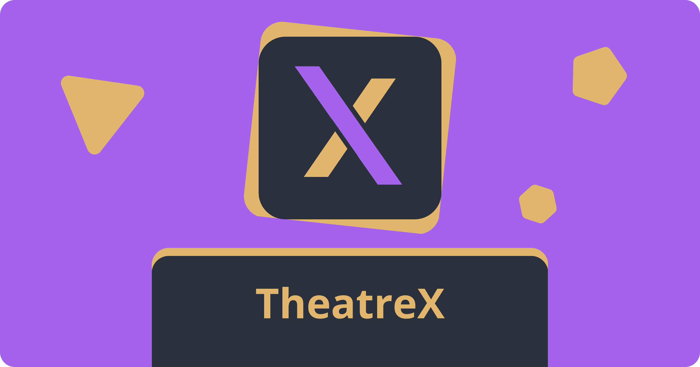
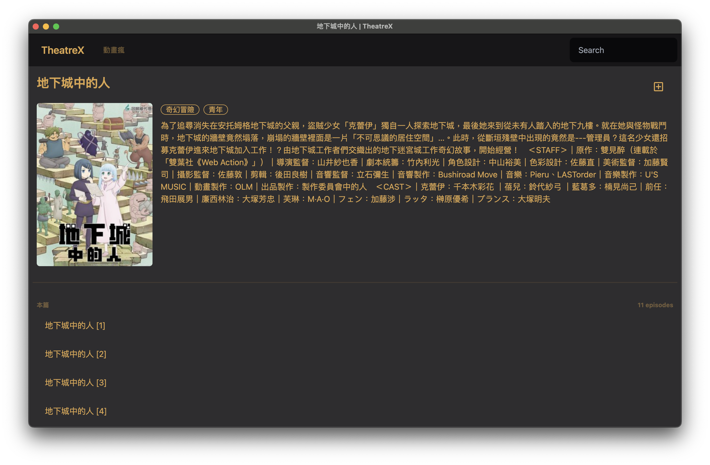
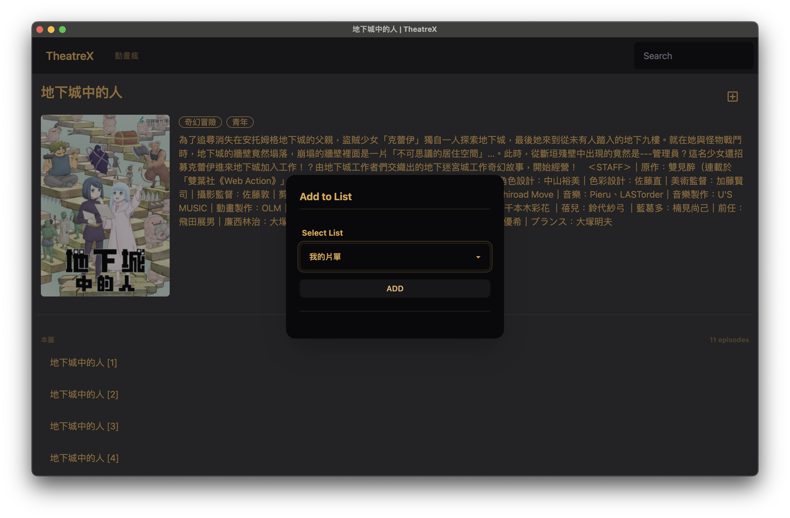
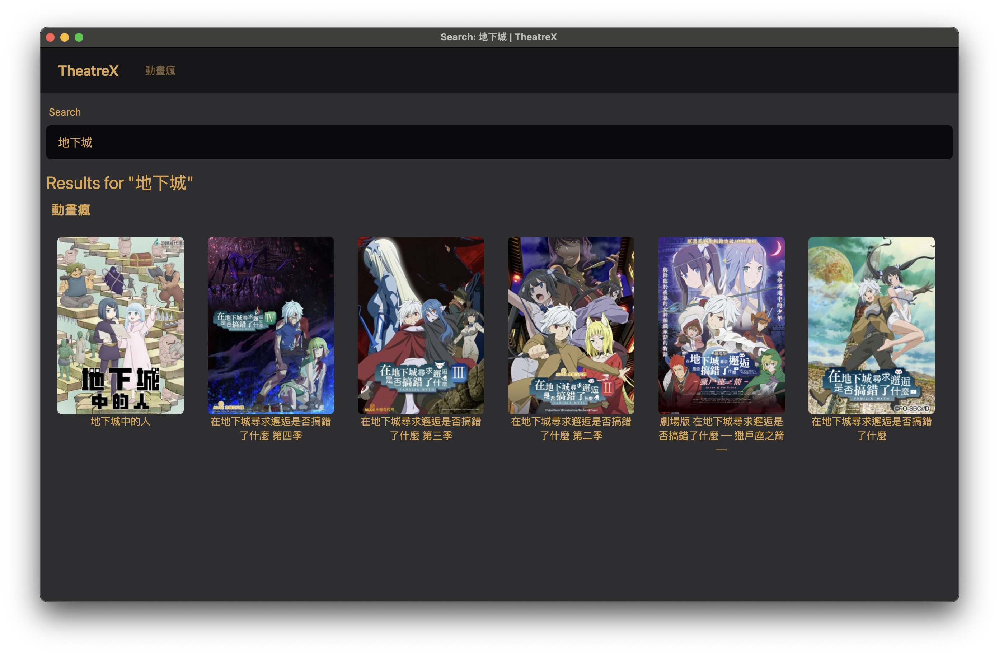
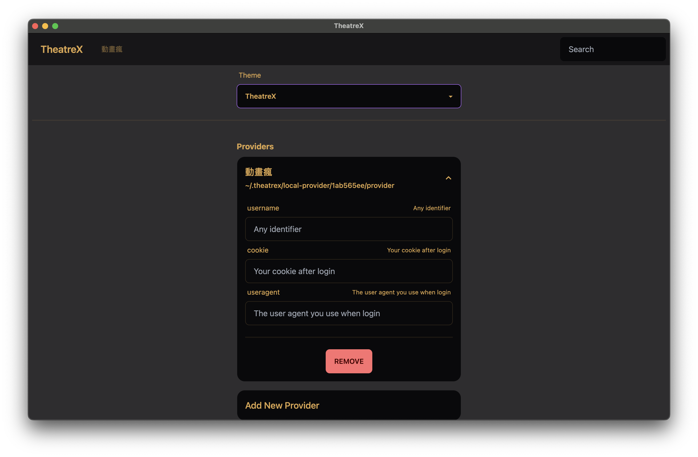

# TheatreX



TheatreX is a place to combine all your favorite streaming services into a single, unified experience.

## Features

- **Modular Providers** - TheatreX is built around the concept of providers. Providers are adapters that allow TheatreX to interact with different streaming services. You can write your own provider or use one of the existing ones. Providers can be hosted locally or remotely, anonymously or with authentication, and can be written in any language.
- **Personalized Experience** - Privacy matters. TheatreX keeps your watch history locally, so you can pick up where you left off without having to worry about your data being sold to third parties. It also allows you to create custom playlists, and share them with your friends with export and import functionality.
- **Cross-Platform** - TheatreX is available as a web app, so you can access it from any device with a modern web browser.
- **Comfortable UI** - TheatreX is designed to be as simple and intuitive as possible. Don't like the default theme? Try a different one of the many available themes.

## Getting Started

You can download **TheatreX Desktop** from [here](https://github.com/JacobLinCool/TheatreX-Desktop/releases).

---

If you don't want to use the desktop app, you can run the server by following the instructions below.

Pre-requisites: Node.js installed.

You can use `npx` to run TheatreX Client without installing it.

```bash
npx theatrex
```

Then, open your browser and go to `http://localhost:3000`.

If you want run it by `theatrex` command, you can install it globally.

```bash
npm install -g theatrex
```

Then run `theatrex` command to start the server.

## Client

TheatreX Client connects to different local and remote providers and allows the user to interact with them through a unified interface.

Also, it is responsible for managing the user's preferences, history, and other personal data.

### Configuration

TheatreX Client is configured through a YAML file located at `~/.theatrex/config.yaml`.

```yaml
providers:
    - use: https://remote-provider.com
      auth:
          username: ""
    - use: /local/provider/index.js
      auth:
          username: ""
          other: "value"
```

Users can also configure the client through the UI.

## Provider

TheatreX Provider is an adapter that allows TheatreX Client to interact with a specific service. It is a simple HTTP server that exposes a REST API.

It can be written in any language and can be hosted anywhere.

> Since it may include sensitive information, such as your secret credentials, it is recommended to host it locally.

## Screenshots









